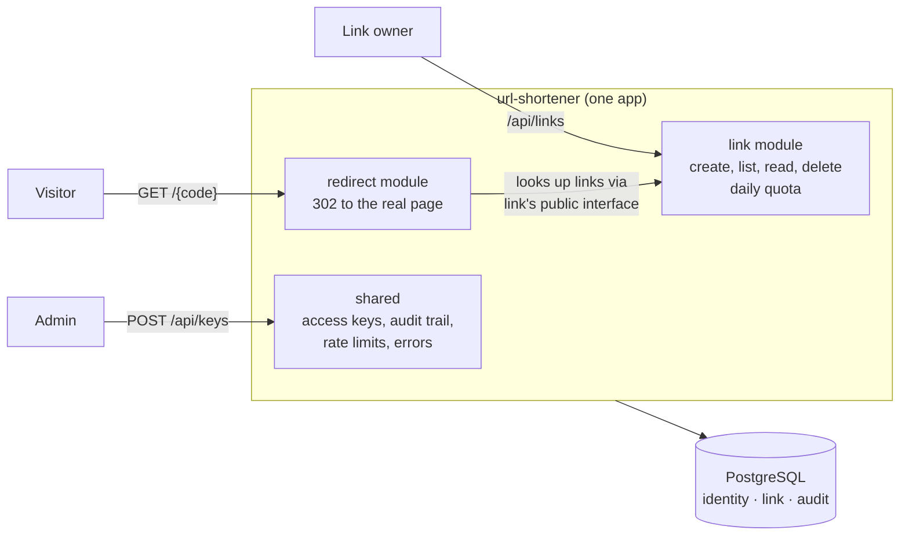

# URL Shortener

## What this is

A long web address like `https://example.com/offers/spring-sale?utm_source=email&utm_campaign=april` becomes a short one like `http://localhost:8080/aB3xK9q`. Anyone who opens the short link lands on the long one.

Three kinds of people use it:

| Who | Example | What they do |
|---|---|---|
| **Admin** | Someone on the platform team | Gives each team or tool its own access key. Nobody can create links without one. |
| **Link owner** | The marketing team, or the email tool they use | Uses its key to create short links, see its own links and delete them. It can never see another owner's links. |
| **Visitor** | A customer clicking a link in an email | Opens the short link and is sent to the real page. Needs no key and sees nothing else. |

There is no website or screen. Everything happens through a web API, so the examples below use `curl` commands.

## How it was built

This is an exercise in building software with AI while keeping an engineer in charge. I wrote the requirements and made every decision. AI agents wrote the code (Claude Code) and reviewed it (Codex). I read and approved every change before it went in, and every step is recorded in this repo.

> **Reviewers, start here:** [`docs/SUMMARY.md`](docs/SUMMARY.md) has the plan, assumptions, constraints, trade-offs, risks and what was left out.

## What's in this repo

```
url-shortener/
├── README.md            you are here
├── AGENTS.md            rules every AI agent must follow (CLAUDE.md just points to it)
├── docs/
│   ├── SUMMARY.md       final summary: the best place to start
│   ├── ARCHITECTURE.md  how the system is designed, with diagrams
│   ├── DECISIONS.md     every major decision, the options considered, and why
│   ├── SECURITY.md      threats, the controls against them, and the test for each
│   ├── AI_LOG.md        what each AI agent was asked, what it produced, what I accepted or rejected
│   └── process/         my general workflow and coding standards
├── specs/               one folder per change, in the order they were built
│   ├── 01-core-shortener/    the first version, built from scratch
│   ├── 02-daily-link-quota/  a change to existing code
│   └── 03-list-links/        a vague request, clarified before building
├── api/openapi.yaml     the API contract
├── src/main/java/...    the application code
│   ├── link/            creating, reading and deleting links
│   ├── redirect/        sending visitors to the real page
│   ├── shared/          access keys, audit trail, rate limits, error handling
│   └── app/             wires everything together and starts the app
├── src/test/java/...    unit, integration and architecture tests
├── src/main/resources/db/migration/   database changes, applied in order
├── compose.yaml, Dockerfile, docker/  run everything locally with Docker
└── scripts/             create an admin key, run the end-to-end smoke test
```

Each folder in `specs/` has the same files: `spec.md` (what and why), `plan.md` (detailed design) and `tasks.md` (small steps, each linked to the requirements it covers). Spec 02 also records how the code behaved before the change, and spec 03 has the list of questions answered before any code was written.

## Run it on your computer (5 steps)

You need [Docker Desktop](https://www.docker.com/products/docker-desktop/) running, plus `git` and `openssl` (both come with macOS and most Linux systems). Java 21 is only needed to run the tests.

1. **Download the code** and go into its folder.
   ```bash
   git clone https://github.com/harshmittal07/url-shortener.git
   cd url-shortener
   ```

2. **Create your settings file.** The repo has a template called `.env.example` in the top folder. Make a copy of it next to it, named `.env`:
   ```bash
   cp .env.example .env
   ```
   `.env` holds your passwords and is never committed. Open it in any text editor and set:

   | Setting | What to put |
   |---|---|
   | `IP_HASH_SALT` | Any random text, 32+ characters |
   | `DB_APP_PASSWORD`, `DB_MIGRATION_PASSWORD`, `POSTGRES_PASSWORD` | Passwords of your choice |
   | `BOOTSTRAP_ADMIN_KEY_HASH` | Leave for now; step 3 fills it in |
   | Everything else | Leave as it is |

   `openssl rand -hex 32` prints a good random value. Avoid `@`, `:` and `/` in passwords.

3. **Create the admin key.**
   ```bash
   scripts/new-admin-key.sh
   ```
   It prints two lines. Copy the `hash` value into `.env` as `BOOTSTRAP_ADMIN_KEY_HASH`. Save the `key` value somewhere safe, like a password manager. It is shown only once and is never stored anywhere.

4. **Start everything.**
   ```bash
   docker compose up --build -d
   ```
   This starts the database, sets up its tables, then starts the app at http://localhost:8080. The first run takes a few minutes.

5. **Check it works.**
   ```bash
   ADMIN_KEY=<your admin key> scripts/smoke-test.sh
   ```
   Every check should pass. To stop, run `docker compose down`. Run it before starting again too.

## Try it (5 steps)

The steps follow the three people above. Paste your admin key first:

```bash
ADMIN_KEY=<your admin key>
```

1. **Admin gives the marketing team a key.** Copy the `key` from the reply.
   ```bash
   curl -s -X POST localhost:8080/api/keys -H "Authorization: Bearer $ADMIN_KEY"
   MARKETING_KEY=<key from the reply>
   ```

2. **Marketing creates a short link.** Copy the `code` from the reply.
   ```bash
   curl -s -X POST localhost:8080/api/links \
     -H "Authorization: Bearer $MARKETING_KEY" -H "Content-Type: application/json" \
     -d '{"targetUrl":"https://example.com/offers/spring-sale"}'
   CODE=<code from the reply>
   ```

3. **A visitor opens it.** The reply is `302` with a `Location` header pointing to the real page. Paste the `shortUrl` into a browser to see it work.
   ```bash
   curl -i localhost:8080/$CODE
   ```

4. **Marketing checks its links,** newest first.
   ```bash
   curl -s "localhost:8080/api/links?limit=10" -H "Authorization: Bearer $MARKETING_KEY"
   ```

5. **Marketing deletes the link.** After that, opening it returns `404`.
   ```bash
   curl -s -X DELETE localhost:8080/api/links/$CODE -H "Authorization: Bearer $MARKETING_KEY"
   curl -i localhost:8080/$CODE
   ```

Worth trying too: a link to `http://127.0.0.1` is refused, a second owner's key gets `404` on marketing's link, and more than 30 creates in a minute get `429`.

### All endpoints

| Endpoint | What it does | Who can call it |
|---|---|---|
| `POST /api/keys` | Issue an owner key | Admin |
| `POST /api/links` | Create a short link | Link owner |
| `GET /api/links` | List your active links | Link owner |
| `GET /api/links/{code}` | One link's details | Link owner (own links only) |
| `DELETE /api/links/{code}` | Delete a link | Link owner (own links only) |
| `GET /{code}` | Go to the real page | Anyone |

The full contract is in [`api/openapi.yaml`](api/openapi.yaml).

## Test it

| What | Command |
|---|---|
| Unit tests | `./gradlew test` |
| Everything: unit and integration tests, architecture rules, formatting, coverage, API compatibility | `./gradlew check` |
| Secret scan | `gitleaks detect --source .` |
| Dependency scan | `./gradlew dependencyCheckAnalyze` |

Integration tests need Docker running.

## Architecture

One app, split inside into modules with strict boundaries, so parts can be pulled out into separate services later without rewriting them.

**As built today (after specs 01, 02 and 03):**



| Read more | Where |
|---|---|
| Full design: components, flows, data, failure handling | [`ARCHITECTURE.md`](docs/ARCHITECTURE.md) |
| Target design, including parts not built yet (cache, click analytics) | [Component view](docs/ARCHITECTURE.md#4-component-view) |
| How it would split into services, and what would trigger each step | [Evolution and extraction path](docs/ARCHITECTURE.md#10-evolution-and-extraction-path-d7) |
| Which spec built which part | [Scenario mapping](docs/ARCHITECTURE.md#11-scenario-mapping-d9) |
| Detailed design of each change | `plan.md` in [01](specs/01-core-shortener/plan.md), [02](specs/02-daily-link-quota/plan.md), [03](specs/03-list-links/plan.md) |

## How the AI was kept in check

The work covers three kinds of situation, built one after another on the same code:

| Situation | Spec | What it shows |
|---|---|---|
| Starting from scratch | [`01-core-shortener`](specs/01-core-shortener) | Keys, links, redirects, URL safety rules and an audit trail, built test-first |
| Changing existing code | [`02-daily-link-quota`](specs/02-daily-link-quota) | A daily limit per key, added after recording how the code behaved before |
| A vague request | [`03-list-links`](specs/03-list-links) | "Marketing teams want to see their links": questions written down and answered before any code |

- Every change started from a spec, a plan and a task list that I approved.
- Claude Code built one task at a time, writing tests first. Codex reviewed without being able to change anything. I read every change and approved every commit.
- [`AGENTS.md`](AGENTS.md) holds the rules every agent loads. Agents can't read passwords or push code.
- The build fails on broken tests, broken architecture rules, low coverage or a breaking API change, and agents are not allowed to weaken those checks.
- In each task, the agent deliberately broke a security control to prove a test catches it, then put the code back exactly.
- [`docs/AI_LOG.md`](docs/AI_LOG.md) records every task: what the AI was asked, what it produced, whether I accepted, edited or rejected it, and why.
