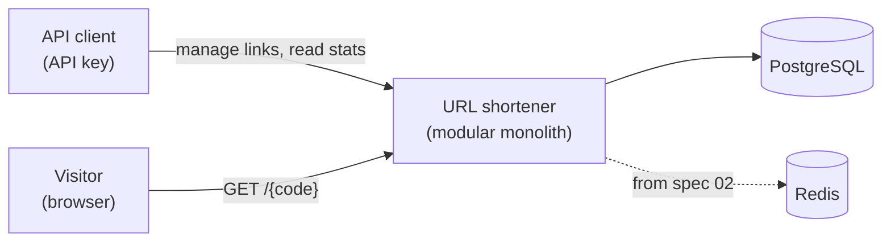
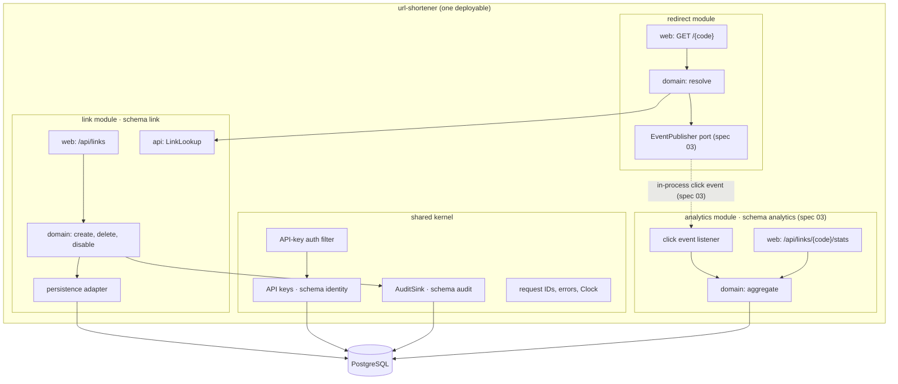
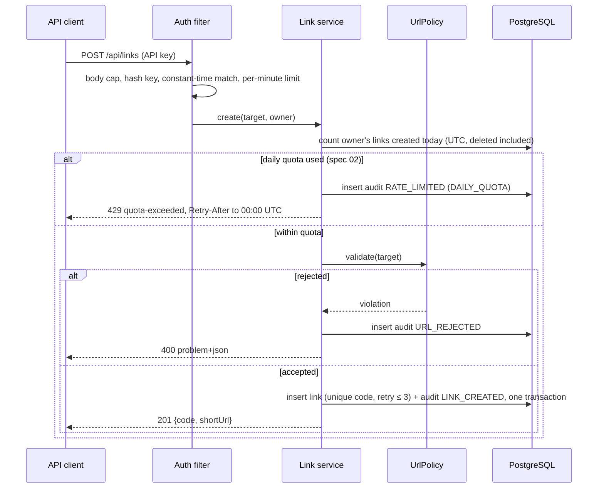
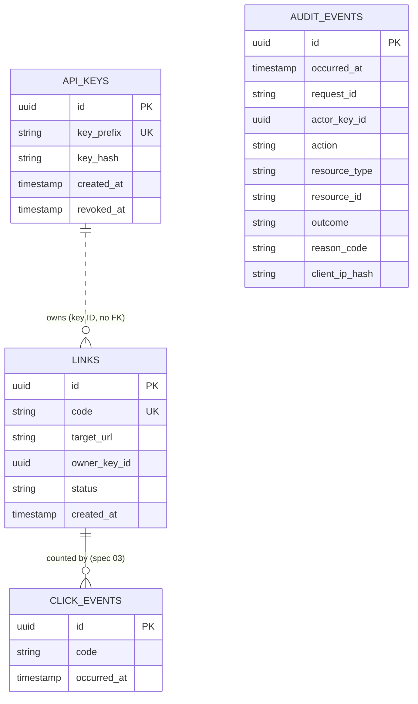
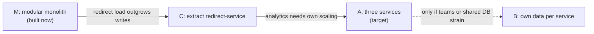

# Architecture (high-level design)

Owner: the engineer. Plans (`specs/*/plan.md`) must conform to this document and to `docs/DECISIONS.md`.
Low-level design for each change lives in that spec's `plan.md`.

## 1. Purpose and scope
A service that turns long URLs into short codes, redirects visitors from a short code to the original URL, and reports click counts to the link's owner.
API clients authenticate with API keys and manage only their own links. Visitors following a short link do not authenticate.

In scope: link creation and deletion, redirects, link takedown, click analytics, audit of every state change.
Out of scope: user accounts and login UI, custom domains, custom aliases, link previews, billing.

## 2. Quality attributes
| Attribute | What it means here | How it is achieved |
|---|---|---|
| Security | Malicious or internal targets rejected; owners isolated; secrets never exposed | URL policy, hashed keys, owner scoping, rate limits (SECURITY.md) |
| Auditability | Every state change and security rejection is recorded and cannot be altered | Append-only `audit_events`, same-transaction writes, request IDs |
| Composability | Infrastructure and modules can be swapped or extracted without touching domain logic | Ports and adapters, module `api` packages, ArchUnit |
| Reliability | Redirects keep working when non-essential parts fail | Fail-open cache (spec 02), async analytics (spec 03), DB as source of truth |
| Performance | Redirect path does no synchronous writes | Read-only lookup; async click event from spec 03; cache from spec 02 |
| Evolvability | Contract changes never break clients | Versionless API with oasdiff gate (D6) |
| Runnability | One command runs the whole system locally | Docker Compose |

## 3. System context


## 4. Component view


This is the target design. Click events, the `EventPublisher` port and the analytics module are introduced by spec 03; until then the redirect module only resolves codes and publishes nothing.

Rules (enforced by ArchUnit, detailed in AGENTS.md §6):
- Modules call each other only through `api` interfaces or, from spec 03, events. `redirect` resolves codes through `LinkLookup`, never through link tables.
- Each module owns its schema. The shared kernel holds only cross-cutting concerns, never business rules.
- `app` is the composition root and the only place adapters are wired.

## 5. API surface (versionless, D6)
| Method and path | Purpose | Auth | Spec |
|---|---|---|---|
| `POST /api/keys` | Issue an owner API key | Admin key | 01 |
| `POST /api/links` | Create a short link | API key | 01 |
| `GET /api/links/{code}` | Link metadata (owner only) | API key | 01 |
| `DELETE /api/links/{code}` | Delete a link (owner only) | API key | 01 |
| `GET /api/links` | List the caller's links (owner only) | API key | 03 |
| `GET /{code}` | Redirect with `302` | none | 01 |
| `GET /v3/api-docs` | OpenAPI document | none | 01 |

Spec 02 adds no endpoint: the daily link quota applies to `POST /api/links`. Takedown (`POST /api/links/{code}/disable`) and click stats (`GET /api/links/{code}/stats`) are follow-ups (D16).

The contract baseline is `api/openapi.yaml`. Errors use RFC 9457 problem details.

## 6. Key flows

**Create link**

The full check order and the daily quota's design are in `specs/02-daily-link-quota/plan.md`.

**Redirect** (target design: cache steps arrive in spec 02; `EventPublisher` and the click event arrive in spec 03)
```mermaid
sequenceDiagram
  participant V as Visitor
  participant R as Redirect service
  participant K as Redis cache
  participant LK as LinkLookup (link module)
  participant E as EventPublisher
  V->>R: GET /{code}
  R->>K: get(code)
  alt hit
    K-->>R: target
  else miss or Redis down
    R->>LK: find active link
    LK-->>R: target or not found
    R->>K: put(code, target, TTL) when available
  end
  R-)E: ClickEvent (spec 03; async, never blocks)
  R-->>V: 302 Location: target (or 404)
```

## 7. Data model (initial)

Schemas: `identity` (api_keys, owned by the shared kernel), `link` (links), `audit` (audit_events, owned by the shared kernel), `analytics` (spec 03 decides the final shape). `links.owner_key_id` holds the owner's key ID with no foreign key: no foreign keys cross schemas, and the link module never reads `identity` tables.

## 8. Deployment
`docker compose up --build` starts: PostgreSQL 16, a one-shot Flyway migration step, the application container (non-root, read-only root filesystem, actuator on a separate internal port), and Redis 7 (from spec 02). Configuration comes from environment variables; `.env.example` documents them.

The database has two users:
- **Migration user:** owns the schemas and runs Flyway in the one-shot step. Only that step gets its credentials.
- **Application user:** serves requests. It has no DDL rights and only `INSERT` and `SELECT` on `audit.audit_events`. The application container receives only these credentials.

## 9. Failure modes
| Failure | Behaviour | Why |
|---|---|---|
| Redis unavailable | Read from PostgreSQL; log and count the fallback | Cache is an optimisation, never a dependency (D3) |
| PostgreSQL unavailable | Management API and uncached redirects return `503`; cached redirects still served | DB is the source of truth |
| Analytics listener fails (from spec 03) | Redirect still succeeds; event failure is logged and counted | Analytics never degrades the redirect path (D11) |
| Audit write fails | The whole state change rolls back | No change without a record (S-10) |
| Audit write fails on a rejection | The request is still rejected with its original response; the audit failure is logged | A rejection never fails open (R20 in spec 01) |
| Short-code collision | Retry up to 3 times, then `503` | Constraint-based safety (S-06) |
| Rate limit exceeded | `429` with `Retry-After`, audited | Abuse control (S-09) |
| Daily link quota used (spec 02) | `429 quota-exceeded` with `Retry-After` to the next 00:00 UTC, audited; concurrent requests at the limit may overshoot by one or two | Abuse control counted from stored links, shared by all instances (S-09) |
| PostgreSQL unavailable during the quota count | `503`; no link created | The quota never fails open |

## 10. Evolution and extraction path (D7)

What each step changes:
- **C:** `LinkLookup` gets an HTTP or read-replica adapter; `EventPublisher` gets a broker adapter (e.g. Redis Streams); service-to-service auth added. Domain code unchanged.
- **A:** analytics listener becomes a broker consumer; per-module DB roles.
- **B:** transactional outbox, idempotent consumers, projections; accepts eventual consistency for new links.

Stage A depends on click analytics, which D16 defers to a follow-up; until it is built there is no analytics module to extract. Stage C is unaffected, though the Redis cache that would back an extracted redirect service is also deferred (D16).

## 11. Scenario mapping (D9)
| Scenario | Spec | What it proves |
|---|---|---|
| Greenfield | `01-core-shortener` | Secure, audited core built test-first inside module boundaries |
| Brownfield | `02-daily-link-quota` | A daily link quota per API key added to existing, tagged code (`v1-baseline`), with impact analysis and characterization tests |
| Ambiguous | `03-list-links` | Open questions about "let teams see their links" surfaced and resolved explicitly in a clarification log (the main deliverable) before a narrow list endpoint |

Reshaped by D16. Redis cache, link disable and takedown, per-IP redirect limit and click analytics are follow-ups.

## 12. Resolved items from spec 01
- **First API key:** a bootstrap admin key, configured only as its SHA-256 hash (`BOOTSTRAP_ADMIN_KEY_HASH`), issues owner keys via `POST /api/keys`. The admin key cannot own links.
- **Unknown versus deleted codes:** `404` for both, with identical responses. Deleted codes are never reused.
