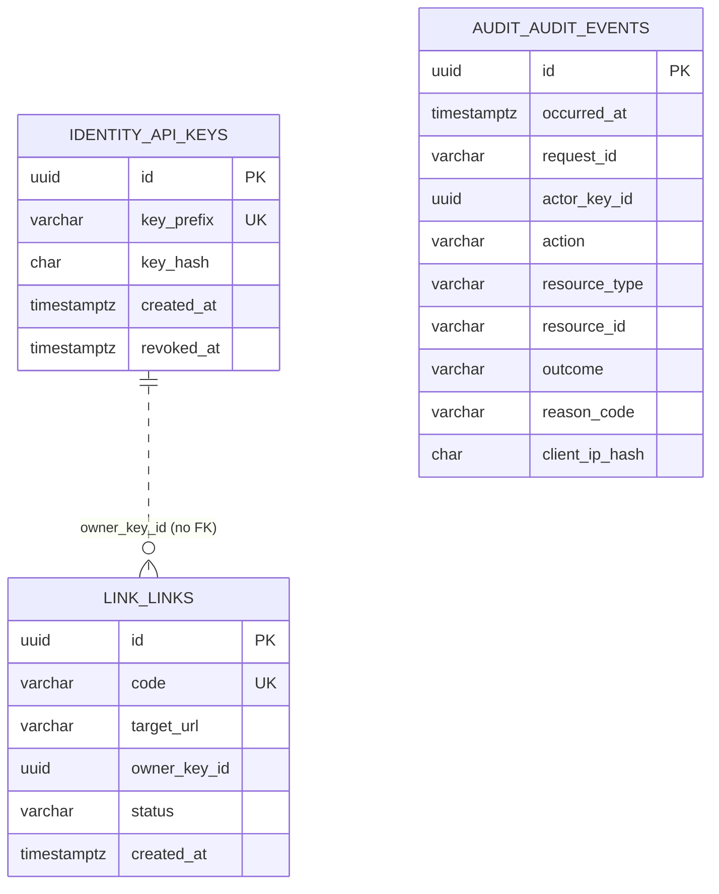
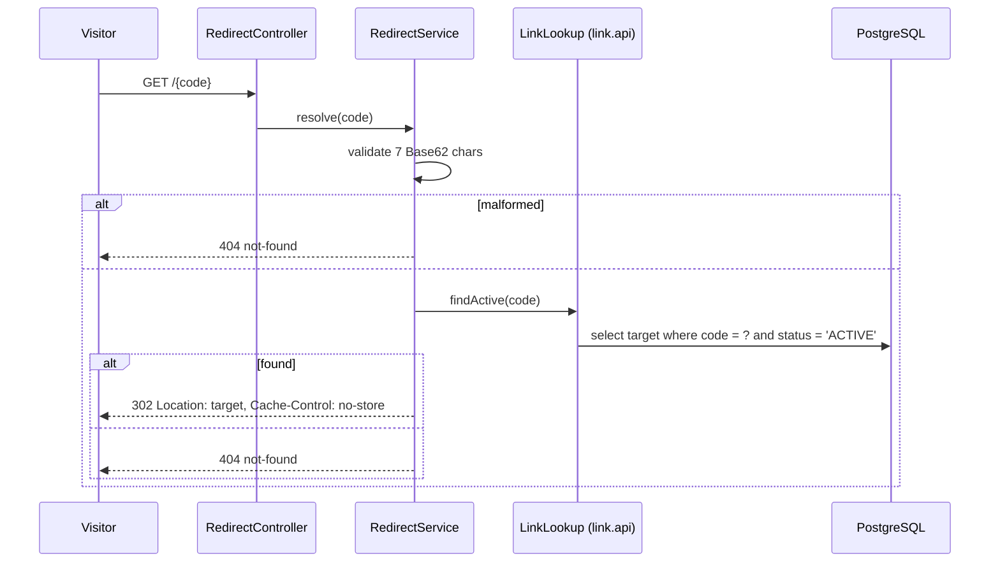

# Plan: 01 Core shortener
Spec: `specs/01-core-shortener/spec.md` (Approved)
Status: Approved (Gate 2)

## 1. Approach
Build the modular monolith in seven tasks. The first two tasks build one thin vertical slice: an owner key creates a link, a visitor is redirected, and both state changes are audited, on the real schema with two database users. The core follows (owner-scoped read and delete, URL policy including punycode, abuse controls and hardening, packaging and the contract gate). The polish task comes last: ECS log format and the audit mirror, and the Swagger profile. It can become a follow-up if time runs short without leaving a security control unbuilt.

Key design choices:
- **Composition root only in `app`.** The main class moves to `...urlshortener.app`. Domain classes carry no annotations. `app` declares every bean in per-module `@Configuration` classes, with no component scanning of modules. ArchUnit enforces this.
- **Persistence with `JdbcClient`, not JPA (D14).** The SQL is explicit and parameterized, nothing maps entities, and transaction boundaries are visible. `spring-boot-starter-data-jpa` is replaced by `spring-boot-starter-jdbc`.
- **Transactions through a `UnitOfWork` port.** Domain services stay free of Spring. A `TransactionTemplate` adapter implements the port, and the unit-test fake runs the work inline.
- **Collision-safe insert.** `INSERT ... ON CONFLICT (code) DO NOTHING` returns zero rows on a collision. A failed insert would abort a Postgres transaction, so this keeps the transaction usable for the retry (R7).
- **Rejection audits in their own transaction and best effort (R20).** `AuditTrail.recordRejection` runs `UnitOfWork.requiresNew`, so an enclosing rollback (for example `ACCESS_DENIED` inside the delete use case) cannot erase the row. A failed write is logged at WARN and never changes the response.
- **Authentication with Spring Security.** A stateless filter chain carries a custom API-key filter. The `Authenticator` port (D4) does the hashing and constant-time comparison. Roles are `ADMIN` and `OWNER`. Custom entry-point and access-denied handlers write problem+json and audit the rejection.
- **Creation rate limit in a `HandlerInterceptor`** on `POST /api/links`. It runs after authentication and before body binding, so validation and policy rejections count (R15). The `413` filter runs earlier, so oversized bodies don't count. The interceptor calls a `RateLimiter` port backed by Bucket4j (D2).
- **Flyway outside the app in Compose (A10).** The `flyway/flyway` image runs once as the migration user. The app runs with `spring.flyway.enabled=false` and only the application user's credentials. Tests enable Flyway with `spring.flyway.user` set to the migration user.

## 2. Alternatives considered
| Choice | Alternative | Why this one |
|---|---|---|
| `JdbcClient` | Spring Data JPA (scaffolded) | Three small tables; explicit SQL keeps `ON CONFLICT` and column grants obvious; no entity layer to keep out of the domain |
| Spring Security filter chain | Plain servlet filter | Already a dependency; gives role checks, security headers and stateless defaults; the filter itself stays thin behind `Authenticator` |
| `flyway/flyway` image as the one-shot step | Same app image in a migrate-only mode | No migrate mode to build or test; the app image never contains a code path that needs DDL credentials |
| Bucket4j behind `RateLimiter` | Hand-written token bucket | Listed in D2; a Redis-backed adapter later (SECURITY.md §10) only swaps the adapter |
| oasdiff in a Testcontainers container | Installed oasdiff binary | Docker is already required for tests; no extra local tool; pinned image version |
| Generated OpenAPI checked against committed `api/openapi.yaml` (A11) | Serving the committed YAML as a static file | An oasdiff check of the generated document against the committed file catches breaking changes only; the exact-match drift check is a follow-up (D15). Static serving could silently diverge from the controllers |
| Distroless `java21-debian12:nonroot` runtime | `eclipse-temurin:21-jre-alpine` + `adduser` | No shell or package manager, non-root by default; nothing needs a container health check |
| HMAC-SHA256 of the IP keyed by `IP_HASH_SALT` | Plain `SHA-256(salt + ip)` | Standard keyed construction; same cost |

## 3. Module, ports and adapters
```
io.github.harshmittal.urlshortener
├── app/                         UrlShortenerApplication, *ModuleConfig, SecurityConfig, WebConfig, RequiredEnvironmentCheck
├── shared/
│   ├── identity/  domain/       ApiKey, ApiKeyIssuer, ApiKeyAuthenticator, Principal, Role,
│   │                            ports: ApiKeyRepository, KeyMaterialGenerator, Authenticator
│   │              adapter/in/web/   KeyController (POST /api/keys), ApiKeyAuthenticationFilter
│   │              adapter/out/persistence/  JdbcApiKeyRepository
│   │              adapter/out/random/       SecureRandomKeyMaterialGenerator
│   ├── audit/     domain/       AuditEvent, AuditAction, Outcome, AuditTrail, port: AuditSink
│   │              adapter/out/persistence/  JdbcAuditSink
│   │              adapter/out/log/          MirroringAuditSink (decorator; T7 removed by D15, now a follow-up)
│   ├── ratelimit/ domain/       port: RateLimiter (RateLimitDecision)
│   │              adapter/out/bucket4j/     Bucket4jRateLimiter
│   ├── tx/        domain/       port: UnitOfWork;   adapter/out/spring/ TransactionTemplateUnitOfWork
│   ├── id/        domain/       port: IdGenerator;  adapter/out/random/ RandomUuidGenerator
│   └── web/                     RequestIdFilter, ClientIpHasher, RequestBodyLimitFilter,
│                                SecurityHeaders, ProblemDetails, SharedExceptionHandler
├── link/
│   ├── api/                     LinkLookup, ActiveLink
│   ├── domain/                  Link, LinkStatus, ShortCode, LinkService (create/get/delete),
│   │                            LinkLookupService (implements api.LinkLookup), StandardUrlPolicy,
│   │                            ports: LinkRepository, ShortCodeGenerator, UrlPolicy
│   └── adapter/  in/web/        LinkController, DTO records, CreationRateLimitInterceptor, LinkExceptionHandler
│                 out/persistence/  JdbcLinkRepository
│                 out/random/       SecureRandomShortCodeGenerator
└── redirect/
    ├── domain/                  RedirectService (resolves through link.api.LinkLookup)
    └── adapter/in/web/          RedirectController (GET /{code})
```

| Port | Owner | Adapters (spec 01) | Contract test |
|---|---|---|---|
| `ApiKeyRepository` | shared.identity | `JdbcApiKeyRepository`, in-memory fake | `ApiKeyRepositoryContract` |
| `KeyMaterialGenerator` | shared.identity | `SecureRandomKeyMaterialGenerator`, fixed fake | `KeyMaterialGeneratorContract` (format, length, uniqueness sample) |
| `Authenticator` | shared.identity | `ApiKeyAuthenticator` (domain) | unit tests (it is the implementation) |
| `AuditSink` | shared.audit | `JdbcAuditSink`, `MirroringAuditSink` (T7 removed by D15, now a follow-up), in-memory fake, failing fake | `AuditSinkContract` |
| `RateLimiter` | shared.ratelimit | `Bucket4jRateLimiter` (Clock-driven `TimeMeter`) | `RateLimiterContract` |
| `UnitOfWork` | shared.tx | `TransactionTemplateUnitOfWork`, inline fake | `UnitOfWorkContract` (commit, rollback, requiresNew survives outer rollback) |
| `IdGenerator` | shared.id | `RandomUuidGenerator`, sequential fake | none (trivial) |
| `LinkRepository` | link | `JdbcLinkRepository`, in-memory fake | `LinkRepositoryContract` (incl. collision returns "taken") |
| `ShortCodeGenerator` | link | `SecureRandomShortCodeGenerator`, scripted fake | `ShortCodeGeneratorContract` (7 Base62 chars) |
| `UrlPolicy` | link | `StandardUrlPolicy` (domain) | unit tests per S-01…S-05 |
| `LinkLookup` (api) | link | `LinkLookupService` | used by redirect; `link.api` contract test |

## 4. API contract (excerpt for `api/openapi.yaml`)
Full file is generated by springdoc and committed in T6. Excerpt:

```yaml
openapi: 3.1.0
info: { title: URL shortener, version: "1" }   # informational only; the API is versionless (D6)
security: [ { apiKey: [] } ]
paths:
  /api/keys:
    post:
      summary: Issue an owner API key (admin only)
      responses:
        "201":
          content: { application/json: { schema: { $ref: "#/components/schemas/CreatedApiKey" } } }
        "401": { $ref: "#/components/responses/Problem" }
        "403": { $ref: "#/components/responses/Problem" }
  /api/links:
    post:
      summary: Create a short link (owner only)
      requestBody:
        required: true
        content: { application/json: { schema: { $ref: "#/components/schemas/CreateLinkRequest" } } }
      responses:
        "201":
          headers: { Location: { schema: { type: string } } }
          content: { application/json: { schema: { $ref: "#/components/schemas/CreatedLink" } } }
        "400": { $ref: "#/components/responses/Problem" }
        "401": { $ref: "#/components/responses/Problem" }
        "403": { $ref: "#/components/responses/Problem" }
        "413": { $ref: "#/components/responses/Problem" }
        "429":
          headers: { Retry-After: { schema: { type: integer } } }
          content: { application/problem+json: { schema: { $ref: "#/components/schemas/Problem" } } }
        "503": { $ref: "#/components/responses/Problem" }
  /api/links/{code}:
    parameters: [ { name: code, in: path, required: true, schema: { type: string } } ]
    get:
      responses:
        "200": { content: { application/json: { schema: { $ref: "#/components/schemas/Link" } } } }
        "404": { $ref: "#/components/responses/Problem" }
    delete:
      responses:
        "204": { description: Deleted }
        "404": { $ref: "#/components/responses/Problem" }
  /{code}:
    get:
      security: []
      responses:
        "302": { headers: { Location: { schema: { type: string, format: uri } } } }
        "404": { $ref: "#/components/responses/Problem" }
components:
  securitySchemes:
    apiKey: { type: http, scheme: bearer }
  schemas:
    CreatedApiKey:
      type: object
      required: [id, key, createdAt]
      properties: { id: { type: string, format: uuid }, key: { type: string }, createdAt: { type: string, format: date-time } }
    CreateLinkRequest:
      type: object
      required: [targetUrl]
      properties: { targetUrl: { type: string, maxLength: 2048 } }
    CreatedLink:
      type: object
      required: [code, shortUrl, targetUrl, createdAt]
      properties: { code: { type: string }, shortUrl: { type: string, format: uri }, targetUrl: { type: string, format: uri }, createdAt: { type: string, format: date-time } }
    Link:
      type: object
      required: [code, shortUrl, targetUrl, status, createdAt]
      properties:
        code: { type: string }
        shortUrl: { type: string, format: uri }
        targetUrl: { type: string, format: uri }
        status: { type: string, enum: [ACTIVE] }   # spec 02 adds DISABLED (additive)
        createdAt: { type: string, format: date-time }
    Problem:
      type: object
      required: [type, title, status, code, requestId]
      properties:
        type: { type: string }
        title: { type: string }
        status: { type: integer }
        code: { type: string }
        requestId: { type: string }
        reason: { type: string, description: "url-rejected only" }
```

Notes:
- `status` is declared as a plain string enum. Adding `DISABLED` in spec 02 is an addition to a response enum, which oasdiff treats as non-breaking for responses. T6 verifies this with oasdiff.
- Problem `type` is `urn:url-shortener:problem:<code>`. It is stable and is not a link.

## 5. Schema changes
Flyway config: `schemas=flyway,identity,link,audit`, `default-schema=flyway`, `create-schemas=true`, placeholder `appUser`. Flyway creates the schemas as the migration user, which therefore owns them. The history table lives in `flyway`, where the app user has no grants.

Database users are created before Flyway runs by `docker/postgres/initdb/01-users.sh`. Tests use the same script. It uses psql variables (`:"name"`, `:'password'`) so no SQL is built from shell strings:
```sql
CREATE ROLE :"migration_user" LOGIN PASSWORD :'migration_password';
CREATE ROLE :"app_user" LOGIN PASSWORD :'app_password';
REVOKE ALL ON DATABASE :"db" FROM PUBLIC;
GRANT CONNECT, CREATE ON DATABASE :"db" TO :"migration_user";
GRANT CONNECT ON DATABASE :"db" TO :"app_user";
```

`V1__identity_api_keys.sql`
```sql
CREATE TABLE identity.api_keys (
    id          uuid        PRIMARY KEY,
    key_prefix  varchar(12) NOT NULL,
    key_hash    char(64)    NOT NULL,
    created_at  timestamptz NOT NULL,
    revoked_at  timestamptz,
    CONSTRAINT api_keys_key_prefix_uk UNIQUE (key_prefix)
);
GRANT USAGE ON SCHEMA identity TO ${appUser};
GRANT SELECT, INSERT ON identity.api_keys TO ${appUser};
```

`V2__link_links.sql`
```sql
CREATE TABLE link.links (
    id            uuid          PRIMARY KEY,
    code          varchar(7)    NOT NULL,
    target_url    varchar(2048) NOT NULL,
    owner_key_id  uuid          NOT NULL,   -- key ID from identity; no cross-schema FK (R5)
    status        varchar(16)   NOT NULL,
    created_at    timestamptz   NOT NULL,
    CONSTRAINT links_code_uk     UNIQUE (code),
    CONSTRAINT links_code_ck     CHECK (code ~ '^[0-9A-Za-z]{7}$'),
    CONSTRAINT links_status_ck   CHECK (status IN ('ACTIVE', 'DELETED'))
);
GRANT USAGE ON SCHEMA link TO ${appUser};
GRANT SELECT, INSERT ON link.links TO ${appUser};
GRANT UPDATE (status) ON link.links TO ${appUser};
```

`V3__audit_audit_events.sql`
```sql
CREATE TABLE audit.audit_events (
    id              uuid        PRIMARY KEY,
    occurred_at     timestamptz NOT NULL,
    request_id      varchar(64) NOT NULL,
    actor_key_id    uuid,
    action          varchar(32) NOT NULL,
    resource_type   varchar(32),
    resource_id     varchar(64),
    outcome         varchar(16) NOT NULL,
    reason_code     varchar(64),
    client_ip_hash  char(64)
);
GRANT USAGE ON SCHEMA audit TO ${appUser};
GRANT SELECT, INSERT ON audit.audit_events TO ${appUser};   -- append-only (S-11)
```

ER delta. All tables are new, and the dotted line marks a reference with no foreign key:


## 6. Key format and identity details
- **Key format:** `usk_<prefix>_<secret>`.
  - `prefix` is 12 Base62 characters. It is the public key ID used for lookup.
  - `secret` is 43 base64url characters (256 bits from `SecureRandom`, D4).
  - `key_hash` is the lowercase hex SHA-256 of the full key string.
- **Authentication:**
  - Parse the bearer token. If it is malformed, fail with `401`.
  - If the token's SHA-256 matches `BOOTSTRAP_ADMIN_KEY_HASH` (`MessageDigest.isEqual`), the caller is admin. The admin actor is the reserved ID `00000000-0000-0000-0000-000000000000` (A3).
  - Otherwise, look up the key by prefix and compare hashes in constant time. When no row matches, compare against a dummy hash anyway, to keep timing uniform. A revoked row fails.
- **`scripts/new-admin-key.sh`:** generates a key in the same format with `openssl rand` and prints `key=` and `hash=` lines. It writes nothing to disk.
- **Client IP hash:** HMAC-SHA256 of the socket remote address, keyed with `IP_HASH_SALT`, as lowercase hex (A6).
- **Request ID:** reused if it matches `^[A-Za-z0-9._-]{1,64}$`, otherwise a generated UUID (A5). It is put in MDC as `requestId`.

## 7. Flows
**Issue owner key and authenticate** (all `/api/**`)
```mermaid
sequenceDiagram
  participant C as Client
  participant RF as RequestId + body-limit filters
  participant AF as ApiKeyAuthenticationFilter
  participant AU as Authenticator
  participant K as KeyController / ApiKeyIssuer
  participant AT as AuditTrail
  participant DB as PostgreSQL
  C->>RF: POST /api/keys (Bearer admin key)
  RF->>AF: requestId in MDC
  AF->>AU: authenticate(token)
  alt missing / malformed / unknown / revoked
    AU-->>AF: failure(reason)
    AF->>AT: recordRejection(AUTH_FAILED) [requiresNew, best effort]
    AF-->>C: 401 problem+json
  else wrong role
    AF->>AT: recordRejection(ACCESS_DENIED)
    AF-->>C: 403 problem+json
  else admin
    AF->>K: issue()
    K->>DB: BEGIN; insert api_keys(prefix, hash); insert audit API_KEY_CREATED; COMMIT
    K-->>C: 201 {id, key, createdAt}
  end
```

**Create link**
```mermaid
sequenceDiagram
  participant C as Owner
  participant RL as CreationRateLimitInterceptor
  participant LC as LinkController
  participant LS as LinkService
  participant P as UrlPolicy
  participant G as ShortCodeGenerator
  participant DB as PostgreSQL
  participant AT as AuditTrail
  C->>RL: POST /api/links (authenticated owner)
  RL->>RL: tryConsume(ownerKeyId)
  alt limit exceeded
    RL->>AT: recordRejection(RATE_LIMITED)
    RL-->>C: 429 + Retry-After
  else allowed
    RL->>LC: bind + validate body
    alt body invalid
      LC-->>C: 400 validation-failed
    else
      LC->>LS: create(target, owner, auditContext)
      LS->>P: evaluate(target)
      alt rejected
        LS->>AT: recordRejection(URL_REJECTED, reason)
        LS-->>C: 400 url-rejected {reason}
      else accepted (normalized)
        LS->>DB: BEGIN
        loop up to 4 attempts
          LS->>G: next()
          LS->>DB: INSERT ... ON CONFLICT (code) DO NOTHING
        end
        alt all attempts collided
          LS->>DB: ROLLBACK
          LS-->>C: 503 code-generation-failed
        else inserted
          LS->>DB: insert audit LINK_CREATED; COMMIT
          LS-->>C: 201 {code, shortUrl, targetUrl, createdAt}
        end
      end
    end
  end
```

**Read or delete own link** (owner scoping)
```mermaid
sequenceDiagram
  participant C as Owner B
  participant LS as LinkService
  participant DB as PostgreSQL
  participant AT as AuditTrail
  C->>LS: delete(code, ownerB)
  LS->>DB: BEGIN; select link by code
  alt absent, malformed or DELETED
    LS->>DB: ROLLBACK
    LS-->>C: 404 not-found
  else owned by another key
    LS->>AT: recordRejection(ACCESS_DENIED) [own transaction]
    LS->>DB: ROLLBACK
    LS-->>C: 404 not-found (identical body)
  else owned by caller and ACTIVE
    LS->>DB: update status = DELETED; insert audit LINK_DELETED; COMMIT
    LS-->>C: 204
  end
```

**Redirect**


**Startup in Docker Compose**
```mermaid
sequenceDiagram
  participant DC as docker compose
  participant PG as postgres (initdb creates users)
  participant FW as migrate (flyway/flyway, one-shot)
  participant APP as app (app-user creds only)
  DC->>PG: start; healthcheck pg_isready
  DC->>FW: start after PG healthy (migration user)
  FW->>PG: create schemas, V1..V3, grants to app user
  FW-->>DC: exit 0
  DC->>APP: start after migrate completed successfully
  APP->>APP: RequiredEnvironmentCheck (fail fast on missing vars)
  APP->>PG: connect as app user
```

## 8. Failure modes
| Failure | Handling | Spec |
|---|---|---|
| Audit write fails during a state change | Exception propagates; `UnitOfWork` rolls back the link or key; `500` problem+json (ERROR log) | R18, AC30 |
| Audit write fails for a rejection | `AuditTrail.recordRejection` catches, logs WARN (action, request ID, key ID only); original rejection response unchanged | R20, AC33 |
| Database down on `/api/**` or redirect | `DataAccessResourceFailureException` / `CannotGetJdbcConnectionException` → `503 service-unavailable`. Hikari `connection-timeout` set to 2 s so requests fail fast | Edge cases, AC42 |
| Database down during authentication | The key lookup throws a data-access error, which maps to `503`, not `401`. Never authenticates. The rejection audit is best effort | R20, D3 |
| Four colliding codes | Transaction rolled back, nothing stored, `503 code-generation-failed` | R7, AC11 |
| Concurrent insert of same code | `ON CONFLICT DO NOTHING` returns 0 rows → retry with a new code | R7 |
| Body over 8 KB (declared or streamed) | `RequestBodyLimitFilter` rejects on `Content-Length` or by a counting stream → `413` before auth and rate limit | R30, R15 |
| Required env var missing or malformed | `RequiredEnvironmentCheck` stops startup with the variable name only, never its value | R22, AC36 |
| Unexpected exception | Shared handler returns `500` with code `internal-error`, logs ERROR with stack trace (server-side only) | R28 |
| Unknown path, trailing slash | `NoResourceFoundException` → the same `404 not-found` body as an unknown code | R13, AC24 |
| Migration step fails in Compose | `migrate` exits non-zero; `app` does not start (`service_completed_successfully`) | R21 |

`500 internal-error` for unexpected exceptions was confirmed at Gate 2 and added to the spec's error-code table. It changes no behaviour.

## 9. Configuration
Environment variables (documented in `.env.example`):

| Variable | Used by | Notes |
|---|---|---|
| `PUBLIC_BASE_URL` | app | Required; `http(s)` URL; host feeds S-04 |
| `IP_HASH_SALT` | app | Required; at least 32 characters |
| `BOOTSTRAP_ADMIN_KEY_HASH` | app | Required; 64 lowercase hex characters |
| `DB_APP_USER`, `DB_APP_PASSWORD` | app, postgres init | Required |
| `DB_MIGRATION_USER`, `DB_MIGRATION_PASSWORD` | migrate, postgres init | Never passed to `app` |
| `POSTGRES_PASSWORD` | postgres | Superuser; dev-only placeholder |
| `LINK_CREATE_LIMIT_PER_MINUTE` | app | Optional; default 30 (R15, D16) |

`application.yaml` sets `spring.flyway.enabled: false`, the management port `8081` with only `health,info` exposed, Swagger UI disabled (springdoc), and the Hikari timeout. The `local` profile enables Swagger UI (moved from T7 to T6, D15).

## 10. Dependencies
| Change | Why |
|---|---|
| Remove `spring-boot-starter-data-jpa`, `-data-jpa-test`; add `spring-boot-starter-jdbc` (+ `-jdbc-test`) | `JdbcClient` persistence (§2) |
| Add `org.springdoc:springdoc-openapi-starter-webmvc-ui` (3.x line for Boot 4) | OpenAPI document and optional Swagger UI (D2, R32) |
| Add `com.bucket4j:bucket4j_jdk17-core` | Creation rate limit (D2, R15) |
| Add `com.tngtech.archunit:archunit-junit5` (test) | Module and layer rules (S-20) |
| Add Gradle plugins `com.diffplug.spotless` (palantir-java-format) and `jacoco` | Formatting and coverage gates (R34) |
| Testcontainers `postgres:16-alpine` (replaces `postgres:latest`) and `tufin/oasdiff` image (pinned) | Match PostgreSQL 16; run oasdiff without a local binary |
| Compose images: `postgres:16-alpine`, `flyway/flyway` (version matched to the Flyway in the Boot 4.1.1 BOM), `gcr.io/distroless/java21-debian12:nonroot` | R21, R33 |

Boot 4.1 compatibility of springdoc, Spotless (on Gradle 9.7) and oasdiff is checked in the task that introduces each. If springdoc 3.x fails on Boot 4.1, the fallback is to serve the committed `api/openapi.yaml` as a static resource. That would drop the contract check, so I'll raise it with you before falling back.

## 11. Build gate (`./gradlew check`)
- `test`: unit tests and ArchUnit; excludes JUnit tag `integration`. Fast, no Docker.
- `integrationTest`: tag `integration`, Testcontainers (one shared Postgres 16 container per JVM).
- `spotlessCheck`, `jacocoTestCoverageVerification` (80% line coverage on `**/domain/**`, merged unit and integration data).
- API compatibility (T6, D15). `ApiContractIT` fetches the generated `/v3/api-docs.yaml` and runs `oasdiff breaking --fail-on ERR` with the committed `api/openapi.yaml` as the base and the generated document as the revision. Any breaking change fails the build. One breaking-change test proves it: a fixture with a removed field must fail the check.
- gitleaks and the dependency scan stay separate commands (S-14, D13).

ArchUnit rules (`src/test/java/.../architecture/`):
1. `..domain..` doesn't depend on `org.springframework..`, `jakarta.persistence..`, `..adapter..` or `..app..`.
2. Domain code doesn't call `Instant.now()`, `LocalDateTime.now()`, `new Random()` or `UUID.randomUUID()`.
3. `redirect` depends on `link` only through `link.api`. `link` doesn't depend on `redirect`. `shared` doesn't depend on any module.
4. Nothing outside `shared.identity` depends on `shared.identity.adapter..`, and `link` doesn't depend on `shared.identity..` at all (AC7).
5. `@Configuration` and `@Bean` appear only in `app`.
6. There are no cycles between module slices.

## 12. Test strategy (per AC)
U = unit with in-memory fakes, I = integration (Testcontainers), A = ArchUnit, M = scripted manual check.

| ACs | Level | Test |
|---|---|---|
| AC1, AC2 | I | `KeyIssuanceIT`. Runs `scripts/new-admin-key.sh` to get a key and hash. Asserts the DB holds only the hash and prefix, the audit row exists, and the plaintext key is absent from captured logs and later responses |
| AC3–AC5 | I | `AuthenticationIT`, parameterized over missing, malformed, unknown and revoked keys and over each role mismatch. Asserts the audit rows |
| AC6 | U | `MigrationsContainNoSecretsTest` scans `db/migration` for `INSERT INTO identity` and key-like literals |
| AC7, AC25 (arch) | A, I | ArchUnit rules 3–4; `SchemaIT` queries `information_schema` for cross-schema FKs |
| AC8–AC11 | U, I | `LinkServiceTest` (scripted generator: 2 collisions then free; 4 collisions); `CreateLinkIT` |
| AC12–AC16 | U, I | `StandardUrlPolicyTest`, a parameterized table per reason; one `UrlRejectedIT` checks the HTTP shape and audit |
| AC17 | U | `StandardUrlPolicyTest`: IDN to punycode (T4) |
| AC18–AC22 | U, I | `LinkServiceTest`; `ManageLinkIT` compares cross-owner and unknown-code responses byte for byte, excluding `X-Request-Id`, `requestId` and `instance` |
| AC23–AC25 | U, I | `RedirectServiceTest`; `RedirectIT` (headers, identical 404s, row counts unchanged after redirect) |
| AC26–AC29 | U, I | `RateLimiterContract` with a fake clock; `CreationRateLimitIT` (limit set to 3 for speed; AC27 uses 2) |
| AC30 | I | `AuditAtomicityIT` with a failing `AuditSink` bean wrapping the real one for state-change actions |
| AC31, AC34 | I | `DatabasePrivilegesIT` opens a separate JDBC connection as the app user and asserts `UPDATE`/`DELETE` on audit and `CREATE`/`ALTER`/`DROP` in the three schemas, plus `CREATE SCHEMA`, are rejected |
| AC32 | I | `AuditEventShapeIT`: every action, with columns asserted and checks for no key, URL or IP |
| AC33 | I | `RejectionAuditFailureIT` with a failing sink: same status and body, no state change, WARN captured and free of secrets |
| AC35, AC47 | M | `scripts/smoke-test.sh` (uses `docker compose`, `curl`, `psql` in the db container): checks users, Flyway history owner, app env without migration creds, non-root, read-only rootfs, create → redirect → delete |
| AC42 (DB outage) | M | `scripts/smoke-test.sh` stops the db container and checks that `/api/**` and a redirect each return `503 service-unavailable` within about 3 seconds (2 second connection timeout plus margin), then restarts it (D15) |
| AC36 | U | `RequiredEnvironmentCheckTest`: for each missing or malformed variable, the message names it and does not contain the value |
| AC37, AC39 | — | Removed by D15; follow-ups in the spec |
| AC38 | I | `EcsLogFormatIT` with an output-capture extension: parses JSON lines, checks ECS fields and `requestId` (T6, D15) |
| AC40 | I | `LogHygieneIT` runs the AC1/3/8/23/26 flows and asserts no key, URL, raw IP or body in captured output |
| AC41 | I | `RequestIdIT`: valid, invalid (CRLF, too long) and missing IDs |
| AC42 | I | `ErrorResponsesIT`: a forced unexpected exception and a `413`. The DB outage is a manual check (above, D15) |
| AC43, AC44 | I | `SecurityHeadersIT`, `BodyLimitIT` (exactly 8,192 bytes accepted; 8,193 rejected; chunked body rejected) |
| AC45 | I | `ActuatorExposureIT` with a random management port |
| AC46 | I | `OpenApiExposureIT` with the default and `local` profiles |
| AC48 | I | `ApiContractIT` (§11). A fixture with a removed field proves the breaking check fails |

Each security control has at least one negative test named `S-xx: ...` (S-01–S-08, S-10–S-12, S-15 via the smoke test, S-16, S-17, S-20).

## 13. Tasks (7 at Gate 3; 6 after D15)
Each task is one commit and ends with `./gradlew check` green and an AI log row.

| # | Task | ACs | Core or polish |
|---|---|---|---|
| T1 | **Foundation and gate.** Move the main class to `app`; package skeleton; JDBC swap; V1–V3 migrations and the users init script; Testcontainers Postgres 16 with Flyway as the migration user; request-ID filter; shared problem+json handler; ArchUnit rules; Spotless; JaCoCo; `test`/`integrationTest` split | AC6, AC7, AC31, AC34, AC41, AC25 (arch) | Core |
| T2 | **Vertical slice.** API keys (issuer, authenticator, filter, roles), `POST /api/keys`, `scripts/new-admin-key.sh`, `AuditTrail` with change and rejection paths, `POST /api/links` (generator, retries, `UrlPolicy` with the scheme rule only), `GET /{code}` | AC1–AC5, AC8–AC11, AC22–AC25, AC30 (create), AC32 | Core |
| T3 | **Owner-scoped read and delete.** `GET` and `DELETE /api/links/{code}`, soft delete, `ACCESS_DENIED` | AC18–AC21, AC30 (delete) | Core |
| T4 | **URL policy.** S-01 to S-05 in `StandardUrlPolicy` (host ranges and IP encodings, userinfo, self-reference, malformed and too long, IDN to punycode) | AC12–AC17 | Core |
| T5 | **Abuse controls and hardening.** Rate limiter and interceptor; body limit; security headers; DB-outage `503` (checked manually, D15); rejection-audit failure; log hygiene; actuator port | AC26–AC29, AC33, AC40, AC42 (DB outage: M), AC43–AC45 | Core |
| T6 | **Packaging and contract.** `RequiredEnvironmentCheck`; Dockerfile (distroless, non-root); Compose (users, one-shot Flyway, `read_only` and `tmpfs`); `.env.example`; springdoc; committed `api/openapi.yaml`; oasdiff breaking check against it; ECS logs and Swagger UI `local` profile (from T7, D15); `scripts/smoke-test.sh` with the DB-outage check | AC35, AC36, AC38, AC42 (DB outage: M), AC46, AC47 (M), AC48 | Core |
| ~~T7~~ | **Removed by D15.** AC38 and AC46 moved to T6; AC37 and AC39 are follow-ups in the spec | — | — |

The order follows dependencies: T2 needs T1's schema, T3 and T4 build on T2's create path, T5 needs all endpoints, and T6 freezes the contract once the endpoints exist. AC17 (punycode) sits in T4 so that S-05 is complete with the core tasks. T7 was removed by D15; spec 01 still meets every security control.

## 14. Risks and rollback
| Risk | Mitigation |
|---|---|
| T1 and T2 are large for one commit each | T2 is a single vertical slice; if it overruns, split at "keys and auth" / "create and redirect" and tell the engineer before continuing |
| springdoc or Spotless incompatible with Boot 4.1 or Gradle 9.7 | Checked first thing in the task that adds them; fallbacks in §10 |
| Timing difference between cross-owner `404` (writes an audit row) and unknown-code `404` | Bodies are identical; the timing gap is one insert. Accepted; noted for review |
| `.env.example` is covered by the agent deny rule `Read(./.env.*)` | The agent cannot read or edit it, and the deny rule stays (Gate 2). In T6 the engineer adds the variable list in §9 to `.env.example` |
| Constant-time compare defeated by an early return on unknown prefix | Dummy-hash compare on miss (§6); unit test asserts the comparison always runs |

Rollback: each task is one commit and can be reverted on its own. Migrations V1–V3 are new and unapplied anywhere outside dev and test, so a rollback before the v1 tag means dropping the dev database volume (`docker compose down -v`). After the v1 tag, schema changes go forward only (AGENTS.md §8).

## 15. Conformance
Conforms to `docs/ARCHITECTURE.md` and `docs/DECISIONS.md` D1–D14. It relies on the ARCHITECTURE.md and SECURITY.md updates from Gate 1: `identity` schema, two database users, S-09 scope, S-14 and S-17. Gate 2 added D14 (`JdbcClient` instead of JPA) and the `internal-error` code in the spec (§8).
