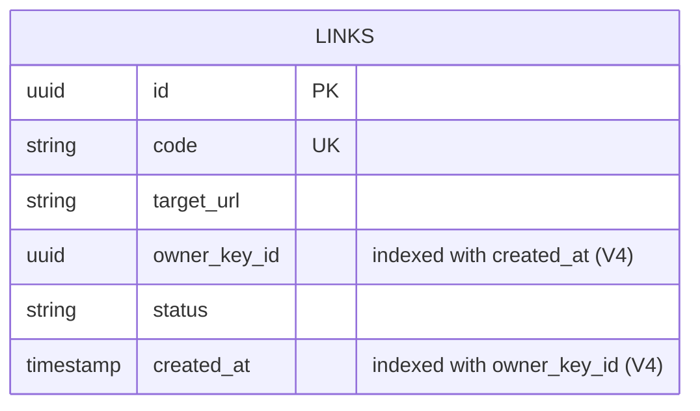
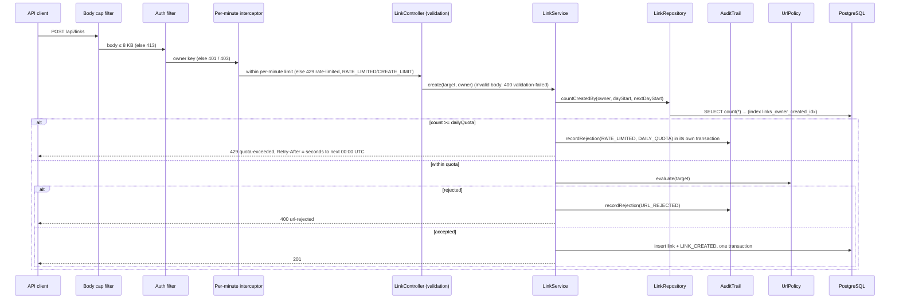

# Plan: 02 Daily link quota per API key
Status: Approved (combined plan and tasks gate, engineer, 2026-10-07)
Spec: `specs/02-daily-link-quota/spec.md` (Approved). Baseline: `current-behavior.md`.

## 1. Approach
The quota is a business rule of the create use case, so it lives in `LinkService.create`, as its first step: after body validation (which happens in the web layer before the service is called) and before the URL policy (R8, Q2).

1. Work out the current UTC day from the injected `Clock`: `[dayStart, nextDayStart)`.
2. Ask the existing `LinkRepository` port how many links the owner created in that window: a new method, `countCreatedBy(ownerKeyId, from, until)`. It counts every row whatever its status, so deleted links count (R2, R4).
3. If `count >= dailyQuota`: WARN log, `RATE_LIMITED` / `DAILY_QUOTA` rejection through `AuditTrail.recordRejection` (own transaction, best effort; R7), then throw `DailyQuotaExceededException(retryAfter = nextDayStart - now)`.
4. Otherwise continue exactly as today: URL policy, then insert and `LINK_CREATED` in one transaction.

The web adapter maps the new exception to `429 quota-exceeded` with `Retry-After`. `V4` adds the index `(owner_key_id, created_at)`. `LINK_DAILY_QUOTA` is bound as a string in `app` and parsed by a small checker so a bad value fails startup without echoing the value (R11, AC19).

The count runs outside the insert transaction. Under concurrency two requests can both read `quota - 1` and both insert; spec L1 / R9 accept this. Moving the count inside the insert transaction would not prevent it under `READ COMMITTED`, so it gains nothing.

### Domain sketch (`link/domain/LinkService.java`)
```java
/** RATE_LIMITED reason for the daily link quota; the per-minute limit uses CREATE_LIMIT (spec 02 R7). */
static final String DAILY_QUOTA = "DAILY_QUOTA";

public Link create(String targetUrl, UUID ownerKeyId, AuditContext context) {
    requireWithinDailyQuota(ownerKeyId, context);
    String normalized = switch (urlPolicy.evaluate(targetUrl)) { ... };   // unchanged
    ...
}

private void requireWithinDailyQuota(UUID ownerKeyId, AuditContext context) {
    Instant now = clock.instant();
    LocalDate today = LocalDate.ofInstant(now, ZoneOffset.UTC);
    Instant dayStart = today.atStartOfDay(ZoneOffset.UTC).toInstant();
    Instant nextDayStart = today.plusDays(1).atStartOfDay(ZoneOffset.UTC).toInstant();
    if (links.countCreatedBy(ownerKeyId, dayStart, nextDayStart) >= dailyQuota) {
        log.warn("Rate limited: reason={} actorKeyId={}", DAILY_QUOTA, ownerKeyId);
        audit.recordRejection(context, AuditAction.RATE_LIMITED, RESOURCE_TYPE, null, DAILY_QUOTA);
        throw new DailyQuotaExceededException(Duration.between(now, nextDayStart));
    }
}
```
`LinkService` gains a constructor parameter `int dailyQuota` and rejects values below 1 with `IllegalArgumentException`, as `Bucket4jRateLimiter` does.

`DailyQuotaExceededException` (`link/domain`) carries the `Duration` and exposes `retryAfterSeconds()`: whole seconds rounded up, minimum 1 (R6). This is the same rule as `CreationRateLimitedException`.

## 2. Alternatives considered
| Option | Why not |
|---|---|
| **Count stored links through `LinkRepository` (chosen)** | Matches R4. Survives restarts. Shared by every instance. Counts only successful creations by construction (R3). |
| In-memory Bucket4j bucket with a daily window | Counts attempts, not created links. Lost on restart. Per instance. Fails R2, R3 and G3. |
| Counter table per key and day (`INSERT ... ON CONFLICT DO UPDATE` in the create transaction) | Strict, but adds a table, a grant and a write per create, to remove an overshoot that is already accepted (L1). Listed as a follow-up. |
| Quota in a web interceptor next to the per-minute limit | Runs before body validation, so it contradicts Q2. Puts a business rule in an adapter. |
| Decorator over the create use case | AGENTS.md §6 reserves decorators for cross-cutting infrastructure (caching, metrics). The quota is a link-module rule that reads the module's own data and must sit between validation and the URL policy, so it belongs in the use case. `LinkService` is also a concrete class, not a port, so a decorator would first need a new interface. |
| A new `DailyQuota` port with its own adapter | Another port and contract test for one `count(*)` over the module's own table. `LinkRepository` already owns that table. |

## 3. Affected files and modules
All changes are in the `link` module, its composition in `app`, config and docs. No other module is touched.

| File | Change | Task |
|---|---|---|
| `src/test/.../link/CreationRateLimitIT.java` | + characterization of the exact `rate-limited` body (AC22) | T1 |
| `src/test/.../link/CreateLinkIT.java` | + characterization: a key with deleted links can still create (G2) | T1 |
| `link/domain/LinkRepository.java` | + `long countCreatedBy(UUID ownerKeyId, Instant from, Instant until)` | T2 |
| `link/adapter/out/persistence/JdbcLinkRepository.java` | + parameterized count query | T2 |
| `src/test/.../link/domain/InMemoryLinkRepository.java` | + count in memory (test fake) | T2 |
| `src/test/.../link/domain/LinkRepositoryContract.java` | + count contract tests (both adapters run them) | T2 |
| `link/domain/LinkService.java` | + `dailyQuota` parameter, `requireWithinDailyQuota`, `DAILY_QUOTA` | T2 |
| `link/domain/DailyQuotaExceededException.java` | new | T2 |
| `src/test/.../link/domain/LinkServiceTest.java` | + quota tests. The `service(...)` fixture gains a quota argument (`Integer.MAX_VALUE` for existing tests). No existing assertion changes. | T2 |
| `link/adapter/in/web/LinkExceptionHandler.java` | + `429 quota-exceeded` handler with `Retry-After` | T2 |
| `link/adapter/in/web/LinkController.java` | `429` description widened (documentation only) | T2 |
| `app/DailyQuotaSetting.java` | new: parses and checks `LINK_DAILY_QUOTA` | T2 |
| `app/LinkConfig.java` | passes the parsed quota to `LinkService` | T2 |
| `src/main/resources/application.yaml` | + `link-daily-quota: ${LINK_DAILY_QUOTA:500}` | T2 |
| `src/main/resources/db/migration/V4__link_links_owner_created_index.sql` | new | T2 |
| `compose.yaml` | + `LINK_DAILY_QUOTA: ${LINK_DAILY_QUOTA:-500}` (R12, Q4) | T2 |
| `api/openapi.yaml` | `429` description widened | T2 |
| `src/test/.../app/DailyQuotaSettingTest.java` | new (AC19) | T2 |
| `src/test/.../link/DailyQuotaIT.java` | new: end-to-end ACs with a settable clock | T2 |
| `src/test/.../app/DailyQuotaDefaultIT.java` | new: default of 500 (AC17), through `DailyQuotaSetting.parse`. It lives in `app` (not `link` as first planned) because the parser is package-private there. | T2 |
| `src/test/resources/application-integration.yaml` | + Hikari `maximum-pool-size: 5` (test profile only). This was not in the plan; see §9. | T2 |
| `src/test/.../migration/SchemaIT.java` | + index exists (AC20) | T2 |
| `src/test/.../shared/ratelimit/domain/SettableClock.java` | + `set(Instant)` helper for the IT | T2 |
| `docs/ARCHITECTURE.md` | create-link flow shows both limits; §9 failure-mode row | T2 |
| `docs/AI_LOG.md` | task rows (outcome left for the engineer) | T1, T2 |
| `specs/02-daily-link-quota/tasks.md`, `spec.md` | ticks, traceability, T9 text proposal | T1, T2 |

Not touched: `.env.example` (you add the line), `SECURITY.md` (you apply the T9 text), `README.md`, `docs/SUMMARY.md`, `AGENTS.md`, `CLAUDE.md`, `DECISIONS.md`, `V1`–`V3`, ArchUnit rules.

No new dependency.

## 4. Data and API changes

### Flyway `V4__link_links_owner_created_index.sql`
```sql
-- Serves the daily link quota (spec 02 R13): count one owner's links in a creation-time window.
CREATE INDEX links_owner_created_idx ON link.links (owner_key_id, created_at);
```
No grants. The application role already has `SELECT` on `link.links`, which is all the count needs.

### Schema delta
No column, table or constraint changes. Mermaid `erDiagram` cannot express indexes, so the delta is shown as a comment on the unchanged entity:


### Count query (`JdbcLinkRepository`)
```sql
SELECT count(*) FROM link.links
WHERE owner_key_id = :ownerKeyId AND created_at >= :from AND created_at < :until
```
The query is parameterized, has no status filter (R2) and uses a half-open window (R1).

### OpenAPI excerpt (`POST /api/links`)
The response is unchanged apart from its description; the shape, header and media type stay the same, so `oasdiff` reports nothing breaking.
```yaml
        "429":
          content:
            application/problem+json:
              schema:
                $ref: "#/components/schemas/Problem"
          description: Per-minute creation limit or daily link quota reached
          headers:
            Retry-After:
              schema:
                type: integer
              style: simple
```
New error code value `quota-exceeded` (`type urn:url-shortener:problem:quota-exceeded`). `code` is a string in the `Problem` schema, so a new value is additive (D6).

### Configuration
| Variable | Property | Default | Valid |
|---|---|---|---|
| `LINK_DAILY_QUOTA` (new, optional) | `url-shortener.link-daily-quota` | 500 | `[0-9]{1,9}`, value ≥ 1 |

`DailyQuotaSetting.parse(String raw)` throws `IllegalStateException("Invalid configuration: LINK_DAILY_QUOTA must be a whole number of at least 1")` for anything else, including an empty value. It is bound as a `String` on purpose. An `int` binding would make Spring's conversion error quote the rejected value, which AC19 forbids. The nine-digit limit keeps values in `int` range without an overflow path.

## 5. Flow


## 6. Ports and adapters
| Port (owner) | Change | Adapters | Contract test |
|---|---|---|---|
| `LinkRepository` (link module, `link/domain`) | + `countCreatedBy` | `JdbcLinkRepository` (production), `InMemoryLinkRepository` (test fake) | `LinkRepositoryContract`, run by `JdbcLinkRepositoryIT` and `InMemoryLinkRepositoryTest` |
| `AuditSink` / `AuditTrail` (shared kernel) | used, unchanged | — | — |
| `Clock` (shared kernel bean) | used, unchanged | `Clock.systemUTC()`; `SettableClock` in tests | — |

No new port and no change to `link/api` (`LinkLookup`). The `redirect` module is untouched, so extraction (ARCHITECTURE §10) is unaffected.

## 7. Failure modes
| Failure | Behavior | Covered by |
|---|---|---|
| Database down during the count | `DataAccessResourceFailureException` / `CannotCreateTransactionException`: existing `503 service-unavailable`. No link created. The quota fails closed. | Existing handler (`SharedExceptionHandler`); manual smoke test (D15) |
| Audit write fails on a quota refusal | Logged WARN; response stays `429 quota-exceeded` (spec 01 R20) | AC11 (`LinkServiceTest` with `FailingAuditSink`) |
| Concurrent creates at `quota - 1` | May overshoot by one or two (L1, R9), accepted | Documented; not tested |
| Day rolls over between the check and the insert | The link is checked against the old day but stored in the new one; at most one extra link, within L1 | Documented |
| `V4` not yet applied (app started against a V3 database) | Count still correct, just a sequential scan | — |
| Invalid `LINK_DAILY_QUOTA` | Startup fails, naming the variable only | AC19 |
| Code-generation failure after the check passes | `503`, nothing stored, nothing counted (R3) | Existing AC11 of spec 01 |

`CREATE INDEX` (not `CONCURRENTLY`) blocks inserts into `link.links` while it builds. The table is small here. At production size this would become a non-transactional `CREATE INDEX CONCURRENTLY` migration. I'm noting it, not changing it.

## 8. Test strategy (per AC)
Integration tests use `DailyQuotaIT`. Its main context sets the quota to 3 and the per-minute limit to 1000, and makes a `@Primary SettableClock` the `Clock` bean (the same `@TestConfiguration` + `@Primary` pattern as `RejectionAuditFailureIT`). Its nested context sets the per-minute limit to 3 and the quota to 2, for check-order cases. Every test uses a fresh owner key, so the shared Testcontainers database needs no cleanup.

| AC | Test (`@DisplayName` prefix) | Level |
|---|---|---|
| AC1 | `LinkServiceTest` "AC1, S-09: at the quota a create is refused, nothing stored, quota-exceeded"; `DailyQuotaIT` same | unit + IT |
| AC2 | `LinkServiceTest` "AC2: the quota-th link is allowed" | unit |
| AC3 | `LinkServiceTest` + `DailyQuotaIT` "AC3, S-09: deleted links still count"; `LinkRepositoryContract` "R2: count includes deleted links" | unit + contract + IT |
| AC4 | `DailyQuotaIT` "AC4: rejected attempts (413, url-rejected, validation-failed) do not count"; nested: "AC4: per-minute rejections do not count" | IT |
| AC5, AC6 | `LinkServiceTest` "AC5/AC6: the window is the UTC day, half-open at midnight"; `DailyQuotaIT` "AC6: 23:59:59.999999 refused, 00:00:00 allowed"; `LinkRepositoryContract` "R1: count window is [from, until)" | unit + contract + IT |
| AC7 | `LinkServiceTest` + `LinkRepositoryContract` "count is per owner"; `DailyQuotaIT` "AC7: another key is unaffected" | unit + contract + IT |
| AC8 | `DailyQuotaIT` "AC8, S-16: body shape and Retry-After 7200 at 22:00:00.250" | IT |
| AC9 | `LinkServiceTest` "AC9: Retry-After is 1 at 23:59:59.999999"; exception unit test for rounding | unit |
| AC10 | `DailyQuotaIT` "AC10, S-10: one RATE_LIMITED/DAILY_QUOTA row, no LINK_CREATED, no link" | IT |
| AC11 | `LinkServiceTest` "AC11: audit failure still refuses" (`FailingAuditSink`) | unit |
| AC12, AC16 | `DailyQuotaIT.CheckOrder` "AC12, AC16: a quota refusal uses a per-minute token; over both, rate-limited wins" | IT |
| AC13, AC14 | `DailyQuotaIT` "AC13: validation before quota", "AC14: quota before URL policy, no URL_REJECTED" | IT |
| AC15 | `DailyQuotaIT` "AC15: 413 and 401 come before the quota" | IT |
| AC17 | `DailyQuotaDefaultIT` "AC17: default quota is 500" (default context; reads the bound property) | IT |
| AC18 | `DailyQuotaIT` runs with quota 3 and nested with 2 | IT |
| AC19 | `DailyQuotaSettingTest` "AC19: 0, -7, abc, 2.5, empty, 10 digits fail naming the variable, not the value" | unit |
| AC20 | `SchemaIT` "AC20: index (owner_key_id, created_at) on link.links"; V1–V3 unchanged shown by `git diff --exit-code v1-baseline -- <V1..V3>`; grants by unchanged `DatabasePrivilegesIT` | IT + git |
| AC21 | Every existing test passes unchanged (`./gradlew check`) | all |
| AC22 | T1 `CreationRateLimitIT` "AC22 (spec 02): rate-limited body keeps its exact field set" | IT (characterization) |

**Characterization (T1, before any production change).** These tests must pass on today's code:
- **G1 / AC22:** the exact set of JSON fields in the `429 rate-limited` body, plus `title` and `status`. The test pins the field set observed today, including `instance` if Spring adds it.
- **G2:** a key that created links and deleted them can create again (`201`). This stays true below the quota.
- **G3:** already covered. AC26's `singleElement()` on the request's audit rows proves a `rate-limited` request writes no `LINK_CREATED`. I'll note this in `current-behavior.md`; no new test.
- Baseline `./gradlew check` on unchanged production code, real output reported.

**Mutation check (T2, before the commit).** Stop counting deleted links:
1. Stage the finished T2 work (`git add`).
2. With the Edit tool, add `AND status = 'ACTIVE'` to the count query in `JdbcLinkRepository`.
3. Run `./gradlew integrationTest --tests '*JdbcLinkRepositoryIT' --tests '*DailyQuotaIT'`. Expected to fail: `R2: count includes deleted links` and `AC3, S-09: deleted links still count`. If either passes, the test is not doing its job, and I stop and report it.
4. Restore byte for byte with `git checkout -- <file>` from the index, then `git diff --exit-code` on the file.
5. Re-run the two classes green. The real output goes in `tasks.md` and the AI log.

The in-memory fake gets the same check in reverse, by reasoning: `LinkServiceTest` AC3 runs against it, so a fake that skipped deleted links would fail AC3 too.

**Gate per task:** `./gradlew spotlessApply` then `./gradlew check` (unit, integration, ArchUnit, Spotless, JaCoCo 80% on domain, oasdiff), and `gitleaks git --staged` before the commit plus `gitleaks git` after it (gitleaks 8.30.1; staged changes and commit history only, never the working folder; SECURITY.md §8).

## 9. Risks and rollback
- **Found in T2: the test database ran out of connections.** `DailyQuotaIT` adds two Spring test contexts (main and nested). Each cached context keeps its own Hikari pool (default 10) against the one shared Testcontainers Postgres (`max_connections` 100). With the two new contexts, `ErrorResponsesIT` failed to start with `remaining connection slots are reserved for roles with the SUPERUSER attribute`. Fix: `maximum-pool-size: 5` in the integration test profile only. No IT sends concurrent requests, and one request needs at most two connections (a rejection's audit write runs in its own transaction). Production keeps Hikari's default.
- **Risk: the clock override leaks into other ITs.** It is declared only in `DailyQuotaIT`'s own context, so cached contexts used by other ITs keep `Clock.systemUTC()`.
- **Risk: existing `LinkServiceTest` fixture change.** Only the constructor call gains `Integer.MAX_VALUE`. No assertion changes, so AC21 holds.
- **Risk: a rolling deploy with two app versions.** Old instances simply don't enforce the quota. The data shape is unchanged.
- **Your running Compose stack:** editing `compose.yaml` does nothing until your next `docker compose up --build`. That run applies `V4` in the Flyway step, and from then on the app enforces the quota (default 500).
- **Rollback:** revert the T2 commit. `V4` stays applied, because Flyway Community has no undo, but the index is harmless. If it must go, add `V5__drop_links_owner_created_index.sql`; never edit `V4`.

## 10. Conformance
Conforms to `docs/ARCHITECTURE.md`:
- link module only, through its own `LinkRepository` port and schema `link`
- `adapter → domain` direction
- `Clock` injected
- audit via `AuditTrail`
- errors as RFC 9457 problem details
- additive API change only

Conforms to `docs/DECISIONS.md`: D3 (Postgres is the source of truth), D6 (versionless, additive), D7 (no cross-module access), D14 (`JdbcClient`, explicit SQL), D16 (daily quota, default 500, on top of the per-minute limit). No decision is contradicted, and no new decision is needed.
