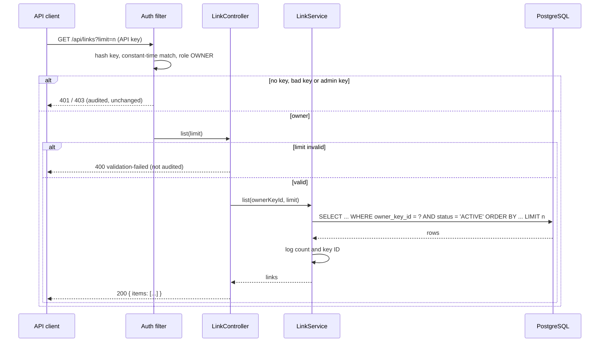

# Plan: 03 List links
Status: Approved (engineer, 2026-10-07; combined plan and tasks gate per the D16 amendment)

## 1. Approach
A read-only use case in the link module, end to end through the existing layers:

- **Port** `LinkRepository.findActiveByOwner(UUID ownerKeyId, int limit)`: the owner's `ACTIVE` links, `createdAt` descending then `code` descending (binary), at most `limit`. The owner condition lives in the query (S-08).
- **Domain** `LinkService.list(UUID ownerKeyId, int limit)`: guards `1 ≤ limit ≤ MAX_LIST_LIMIT` (`IllegalArgumentException`, a programming error since the web layer validates first), reads through the port, logs `Links listed: count={} actorKeyId={}`. No audit, no transaction (single read). `DEFAULT_LIST_LIMIT = 50` and `MAX_LIST_LIMIT = 100` are public constants of `LinkService`, so the business rule has one home.
- **Web** `LinkController.list`: `GET /api/links`, `@RequestParam(defaultValue = "50") @Min(1) @Max(100) int limit`. Spring's built-in method validation raises `HandlerMethodValidationException` and a non-number raises `MethodArgumentTypeMismatchException`; `SharedExceptionHandler` (a `ResponseEntityExceptionHandler`) already turns both into `400 validation-failed` (S-16). Returns a new `LinkListResponse(List<LinkResponse> items)` record (schema `LinkList`).
- **Security**: none. `SecurityConfig` already maps `/api/links` to `OWNER`; the `401`/`403` handlers audit as today.

### Domain sketch
```java
public List<Link> list(UUID ownerKeyId, int limit) {
    if (limit < 1 || limit > MAX_LIST_LIMIT) {
        throw new IllegalArgumentException("The list limit must be from 1 to " + MAX_LIST_LIMIT);
    }
    List<Link> listed = links.findActiveByOwner(ownerKeyId, limit);
    log.info("Links listed: count={} actorKeyId={}", listed.size(), ownerKeyId);
    return listed;
}
```

## 2. Alternatives considered
- Filter by owner in the service after a broader read: rejected, S-08 must hold in the query and a broad read is unbounded.
- Validate `limit` in the domain and map a domain exception to `400`: rejected, Bean Validation on the parameter is the project convention for request input (AGENTS.md §7) and needs no new handler.
- A new index on (`owner_key_id`, `status`, `created_at`, `code`): rejected for now; V4 (`owner_key_id`, `created_at`) supports the scan and keys hold few deleted links. Revisit with cursor paging.
- Sort ties by `id`: rejected, the item has no `id` field; `code` is unique and visible, so the order is checkable by clients.
- `ORDER BY code` with the database collation: rejected, a linguistic collation orders `a` and `B` differently from Java. `COLLATE "C"` gives binary order, so both adapters agree (R3).

## 3. Affected files and modules
| File | Change |
|---|---|
| `link/domain/LinkRepository.java` | + `findActiveByOwner` |
| `link/domain/LinkService.java` | + `list`, `DEFAULT_LIST_LIMIT`, `MAX_LIST_LIMIT` |
| `link/adapter/out/persistence/JdbcLinkRepository.java` | + query |
| `link/adapter/in/web/LinkController.java` | + `GET /api/links`, `LinkListResponse` |
| `api/openapi.yaml` | + `listLinks`, `LinkList` (additive) |
| test `link/domain/LinkRepositoryContract.java` | + 4 contract tests (both adapters) |
| test `link/domain/InMemoryLinkRepository.java` | + fake implementation |
| test `link/domain/LinkServiceTest.java` | + nested `ListLinks` |
| test `link/ListLinksIT.java` | new, AC1–AC8, AC10–AC12 |
| test `shared/identity/AuthenticationIT.java` | + `GET /api/links` in the endpoint list (AC9) |
| `docs/ARCHITECTURE.md` §5 | `GET /api/links` row detail |
| `docs/AI_LOG.md` | spec 03 gate and task rows |

No change in `app/` (wiring is unchanged: the controller already gets `LinkService`), no migration, no new dependency.

## 4. Data and API changes
### Schema
None. Query (parameterized):
```sql
SELECT id, code, target_url, owner_key_id, status, created_at
FROM link.links
WHERE owner_key_id = :ownerKeyId AND status = 'ACTIVE'
ORDER BY created_at DESC, code COLLATE "C" DESC
LIMIT :limit
```
Served by `links_owner_created_idx (owner_key_id, created_at)` (V4) as a backward index scan; ties on `created_at` are sorted in memory. No `erDiagram` delta.

### OpenAPI excerpt
```yaml
  /api/links:
    get:
      operationId: listLinks
      parameters:
      - in: query
        name: limit
        required: false
        schema:
          type: integer
          format: int32
          default: 50
          maximum: 100
          minimum: 1
      responses:
        "200":
          content:
            application/json:
              schema:
                $ref: "#/components/schemas/LinkList"
          description: OK
        "400": { $ref: "#/components/responses/Problem" }
        "401": { $ref: "#/components/responses/Problem" }
        "403": { $ref: "#/components/responses/Problem" }
        "503": { $ref: "#/components/responses/Problem" }
      summary: List the caller's active links, newest first
components:
  schemas:
    LinkList:
      type: object
      properties:
        items:
          type: array
          items:
            $ref: "#/components/schemas/Link"
      required:
      - items
```

## 5. Flow


## 6. Ports and adapters
- `LinkRepository` (owned by the link module): one new method. Adapters: `JdbcLinkRepository` (production), `InMemoryLinkRepository` (test fake). Both extend `LinkRepositoryContract`, which gains the new contract tests.
- No new port; `LinkLookup` (`link.api`) is untouched, so the redirect module and its extraction path are unaffected.

## 7. Failure modes
| Failure | Behaviour |
|---|---|
| Invalid `limit` | `400 validation-failed`, not audited (R5, R7) |
| Missing, bad or admin key | `401` / `403`, audited by the existing handlers (R6) |
| PostgreSQL unavailable | `503 service-unavailable` from `SharedExceptionHandler` |
| Service called with an out-of-range limit (programming error) | `IllegalArgumentException` → `500 internal-error`; unreachable through the web layer |

## 8. Test strategy (per AC)
| AC | Test |
|---|---|
| AC1, AC2, AC3, AC4, AC5, AC6 | `LinkRepositoryContract` (owner scoping, active only, order with binary tie-break, limit) on both adapters; `ListLinksIT` end to end |
| AC2 | `ListLinksIT` cross-owner test; mutation check removes the owner condition from the JDBC query and must turn it red |
| AC7, AC8 | `ListLinksIT` (parameterized invalid limits; unknown params) |
| AC9 | `AuthenticationIT` endpoint list gains `GET /api/links` (bad credentials → 401, admin → 403) |
| AC10 | `LinkServiceTest` (no audit event) and `ListLinksIT` (no audit row) |
| AC11 | `ListLinksIT` with `OutputCaptureExtension` |
| AC12 | `ListLinksIT` reads `/v3/api-docs`; `ApiContractIT` (AC48) against the updated baseline |
| R4 guard | `LinkServiceTest` (limit 0 and 101 rejected) |

ITs insert rows directly into `link.links` for controlled `created_at` values and volumes (51, 101 links); the per-minute creation limit would otherwise block bulk setup.

## 9. Risks and rollback
- Risk: listing reveals more per call than single reads; mitigated by owner scoping in SQL, the cap of 100 and the mutation check.
- Risk: the hand-written `api/openapi.yaml` excerpt drifts from springdoc's output; AC12 checks the generated document and AC48 checks compatibility.
- Rollback: revert the commit. No migration and no data change.

## 10. Conformance
Conforms to `docs/ARCHITECTURE.md` (§4 link module layering, §5 API table, ports and adapters) and `docs/DECISIONS.md` (D6 additive contract, D14 JdbcClient, D16 narrow list endpoint). No decision is contradicted. SECURITY.md controls used: S-08, S-10, S-12, S-16; no new control.
